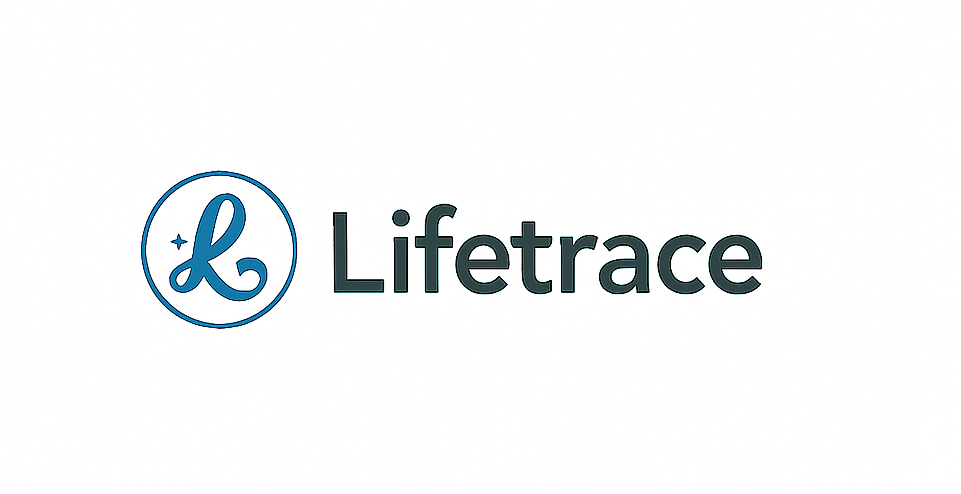

     

**Language**: [English](README.md) | [中文](README_CN.md)

[📖 Documentation](doc/README.md) • [🚀 Quick Start](#deployment-and-configuration) • [💡 Features](#core-features) • [🔧 Development](#development-guide) • [🤝 Contributing](#contributing)

# LifeTrace - Intelligent Life Recording System

## Project Overview

LifeTrace is an AI-powered intelligent life recording system that helps users record and retrieve daily activities through automatic screenshot capture, OCR text recognition, and multimodal search technologies. The system supports traditional keyword search, semantic search, and multimodal search, providing powerful life trajectory tracking capabilities.

## Core Features

- **Automatic Screenshot Recording**: Timed automatic screen capture to record user activities
- **Intelligent OCR Recognition**: Uses RapidOCR to extract text content from screenshots
- **Multimodal Search**: Supports text, image, and semantic search
- **Vector Database**: Efficient vector storage and retrieval based on ChromaDB
- **Web API Service**: Provides complete RESTful API interfaces
- **Frontend Integration**: Supports integration with various frontend frameworks

## 📋 TODO & Roadmap

### 🚀 High Priority


- ☐ **User Experience Improvements**
  - ☐ Implement keyboard shortcuts for power users
  - ☐ Create interactive onboarding tutorial


  

### 💡 Future Ideas


- ☐ **Mobile & Cross-Platform**
  - ☐ Develop mobile companion app
  - ☐ Add tablet-optimized interface
  - ☐ Create web-based version


### ✅ Recently Completed
- ☑ **Core Infrastructure** - Basic screenshot recording and OCR functionality


---

> 💡 **Want to contribute?** Check out our [Contributing Guidelines](#contributing) and pick up any TODO item that interests you!

## Deployment and Configuration

### Environment Requirements
- Python 3.13+
- Supported OS: Windows, macOS
- Optional: CUDA support (for GPU acceleration)

### Install Dependencies

All dependency files are located in the `requirements/` directory.

**For Windows:**
```bash
pip install -r requirements/requirements_windows.txt

```

**For macOS:**
```bash
pip install -r requirements/requirements_macos.txt

```

### Initialize Database
```bash
python init_database.py
```

### Starting Services

#### Start All Services
```bash
python start_all_services.py
```

#### Start Web Service Only
```bash
python -m lifetrace_backend.server --port 8840
```

#### Start Individual Services
```bash
# Start recorder
python -m lifetrace_backend.recorder

# Start processor
python -m lifetrace_backend.processor

# Start OCR service
python -m lifetrace_backend.simple_ocr
```

## Development Guide

### Project Structure
```
LifeTrace_app/
├── lifetrace_backend/          # Core backend modules
│   ├── __init__.py
│   ├── __main__.py
│   ├── server.py               # Web API service
│   ├── models.py               # Data models
│   ├── config.py               # Configuration management
│   ├── storage.py              # Storage management
│   ├── simple_ocr.py           # OCR processing
│   ├── vector_service.py       # Vector service
│   ├── multimodal_*.py         # Multimodal services
│   ├── processor.py            # File processing
│   ├── recorder.py             # Screen recording
│   ├── heartbeat.py            # Service heartbeat
│   ├── rag_service.py          # RAG service
│   ├── retrieval_service.py    # Retrieval service
│   ├── sync_service.py         # Sync service
│   ├── utils.py                # Utility functions
│   └── templates/              # HTML templates
├── config/                     # Configuration files
│   ├── config.yaml
│   └── default_config.yaml
├── doc/                        # Documentation
├── front/                      # Frontend application
│   ├── components/             # React components
│   ├── services/               # API services
│   ├── public/                 # Static assets
│   └── package.json            # Frontend dependencies
├── debug/                      # Debug and diagnostic tools
│   ├── test_*.py               # Test files
│   ├── check_*.py              # Status check tools
│   ├── diagnostic_tool.py      # System diagnostics
│   ├── memory_analyzer.py      # Memory analysis
│   └── *.py                    # Other debug utilities
├── requirements/               # Dependency files
│   ├── requirements.txt        # Main dependencies
│   ├── requirements_multimodal.txt
│   ├── requirements_rapidocr.txt
│   └── requirements_vector.txt
├── assets/                     # Static assets
├── start_all_services.py       # Main service launcher
├── init_database.py            # Database initialization
├── init_config.py              # Configuration initialization
└── setup.py                    # Project setup
```


## Contributing

The LifeTrace community is possible thanks to thousands of kind volunteers like you. We welcome all contributions to the community and are excited to welcome you aboard.

> Please follow these steps to contribute.

**Recent Contributions:**

  

**How to contribute:**

1. **🍴 Fork the project** - Create your own copy of the repository
2. **🌿 Create a feature branch** - `git checkout -b feature/amazing-feature`
3. **💾 Commit your changes** - `git commit -m 'Add some amazing feature'`
4. **📤 Push to the branch** - `git push origin feature/amazing-feature`
5. **🔄 Create a Pull Request** - Submit your changes for review

**Areas where you can contribute:**

- 🐛 **Bug Reports** - Help us identify and fix issues
- 💡 **Feature Requests** - Suggest new functionality
- 📝 **Documentation** - Improve guides and tutorials
- 🧪 **Testing** - Write tests and improve coverage
- 🎨 **UI/UX** - Enhance the user interface
- 🔧 **Code** - Implement new features and improvements

**Getting Started:**

- Check out our [Contributing Guidelines](CONTRIBUTING.md)
- Look for issues labeled `good first issue` or `help wanted`
- Join our community discussions in Issues and Pull Requests

We appreciate all contributions, no matter how small! 🙏


## Document
We use deepwiki to manage our docs, please ref to this [**website.**](https://deepwiki.com/tangyuanbo1/LifeTrace_app/6.2-deployment-and-setup)

## Star History

[](https://www.star-history.com/#tangyuanbo1/LifeTrace_app&Timeline)


## License

Copyright © 2024 LifeTrace.org

The content of this repository is bound by the following licenses:

• The computer software is licensed under the [Apache License 2.0](LICENSE).
• The learning resources in the `/doc` directory including their subdirectories thereon are copyright © 2024 LifeTrace.org

### Apache License 2.0

Licensed under the Apache License, Version 2.0 (the "License");
you may not use this file except in compliance with the License.
You may obtain a copy of the License at

    http://www.apache.org/licenses/LICENSE-2.0

Unless required by applicable law or agreed to in writing, software
distributed under the License is distributed on an "AS IS" BASIS,
WITHOUT WARRANTIES OR CONDITIONS OF ANY KIND, either express or implied.
See the License for the specific language governing permissions and
limitations under the License.
